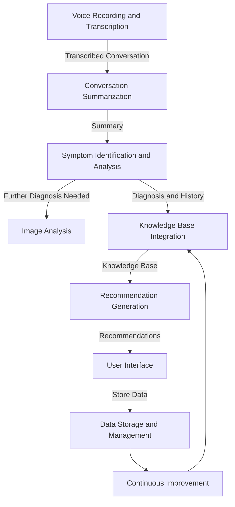

# FinalProject

## Project Resources
Youtube Video URL: 
App link (hosted on Google Cloud):

## Live application Links
[]( https://codelabs-preview.appspot.com/?file_id=1pi7QseL9IrVMDiInLdGWVaC9McmrILCVLP_ml_icGlI#0)
[](https://colab.research.google.com/drive/15hzHqTEWEA3mODdOzBBs7hKNeoz7Bj7d#scrollTo=yO3GCFVqjeoF)
[](https://colab.research.google.com/drive/1z_bdJxOZ216nw997gTckQT6ZLWcJr4jP?usp=sharing)
[](https://colab.research.google.com/drive/1fSoI3f0jRflBNtc3EdGbU76-oyPbj3-A?usp=sharing)
[](https://colab.research.google.com/drive/1fSoI3f0jRflBNtc3EdGbU76-oyPbj3-A?usp=sharing)

## Technologies Used


[](https://docker.com/)


## Overview

Perclias is basically AI for doctors! Leveraging conversational AI to assist patients and healthcare professionals can greatly enhance the efficiency and effectiveness of healthcare delivery. By analyzing patient-doctor conversations and utilizing data-driven approaches, Perclias can provide personalized healthcare solutions, diagnosis, and treatment recommendations tailored to individual needs. This could significantly improve patient outcomes and streamline the healthcare process.

## Problem statement
● Inefficient Information Management: Manual capture and organization of patient-doctor conversations can be time-consuming and prone to errors, leading to inefficiencies in healthcare delivery.

● Limited Personalization: Providing personalized healthcare recommendations based on individual patient symptoms and medical history is challenging, particularly in high-volume healthcare settings where time constraints are prevalent.

● Communication Barriers: Effective communication between patients and healthcare professionals is essential for accurate diagnosis and treatment. However, language barriers, medical jargon, and limited consultation time often impede this process, hindering the quality of care provided.

## Technology Stack

1. Streamlit
2. WhisperAI
3. GCP 
4. OpenAI
5. S3
6. Gemini Vision Pro
7. Beautiful Soup + Selenium 
8. Snowflake
9. Apache Airflow
10. Pinecone
11. AWS
12. Langchain
13. Firebase
    
## Architecture Workflow


## Project Structure

```
📦 FinalProject
├─ ReadMe
├─ Documentation
├─ ETL
│  ├─ main.py
│  ├─ requirements.txt
|  ├─ scraping.py
|  ├─ snowflake_load.py
│  └─ validation.py
├─ Images
│  ├─ About_Us_UI.png
│  ├─ Final_Architecture.jpg
│  ├─ Login_Page_UI.png
|  ├─ Logout_UI.png
|  ├─ Medical_Image_Analysis_UI.png
|  ├─ Medication_Recommendation_UI.png
|  ├─ Part-1.png
|  ├─ Part-2.png
|  ├─ Patient_Management_1_UI.png
|  ├─ Patient_Management_UI.png
│  └─ Perclias_AI_UI.png
|  
|
├─ Snowflake
|   ├─ Patient_data.sql
|
├─ Streamlit
|   |
|   ├─ About_Us.json
|   ├─ Dockerfile
|   ├─Medication.json
|   ├─about.py
|   ├─app1.py
|   ├─app2.py
|   ├─app3.py
|   ├─ doc.json
|   ├─docker-compose.yml
|   ├─head_logo.json
|   ├─login.json
|   ├─login.py
|   ├─logo.jpg
|   ├─logo.json
|   ├─main.py
|   ├─patient.py
|   ├─requirements.txt
|   └─ Medical_Image.json
| 
├─ Validations
    ├─pytest.py
    ├─validation.py
```
## Flow Chart


## Team Information and Contribution 

Name | Contribution %| Contributions |
--- |--- | --- |
Aditya Kanala | 33.33% |OpenAI, Pinecone & Deployment|
Shikhar Patel | 33.33% | Streamlit, LLMs Integration & Snowflake|
Shubh Patel | 33.33% | Scraping, Data Validation, Airflow & Snowflake|
